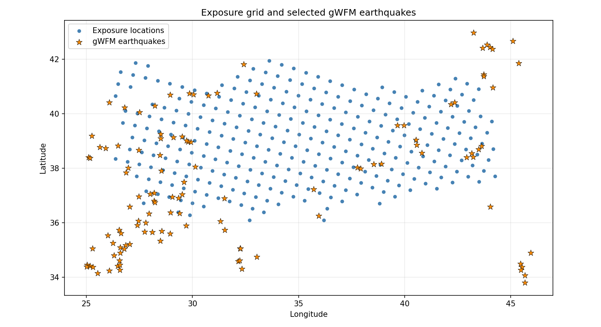
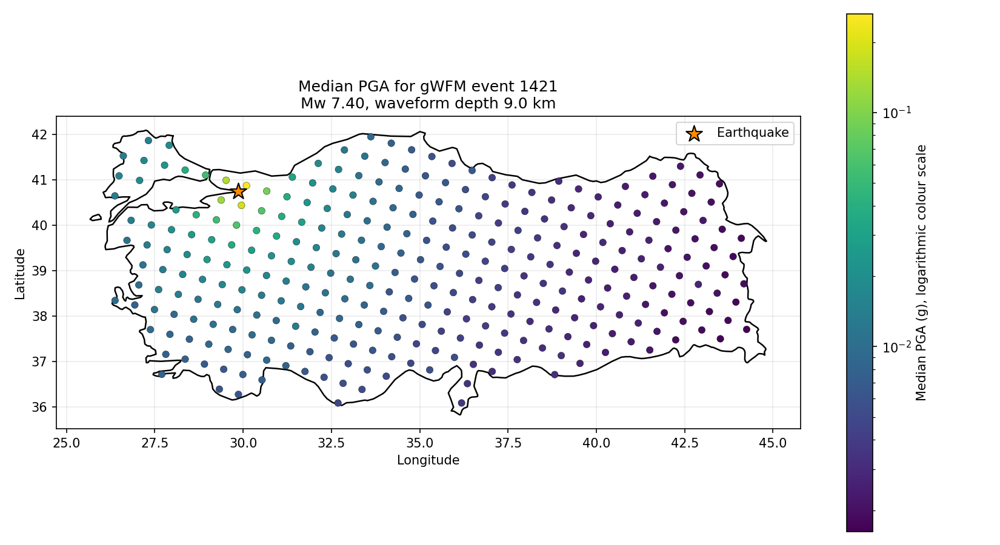
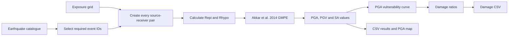
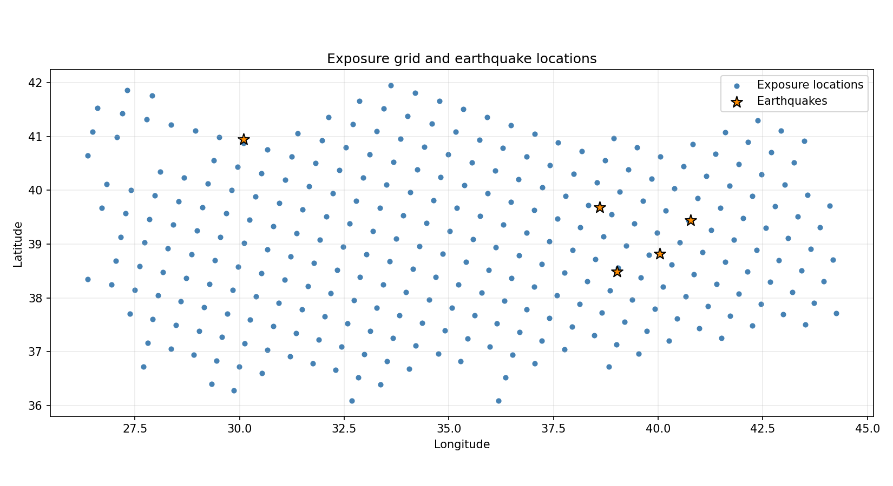
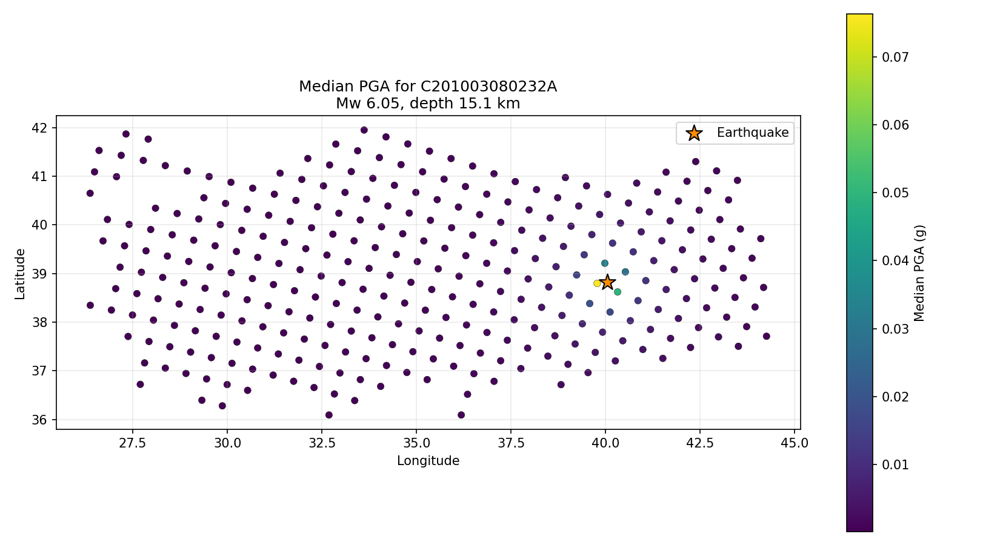

# Turkey Ground-Motion Portfolio: Complete Development and Demonstration Guide

## Purpose of this document

This document records the complete development of the Turkey ground-motion portfolio script from Will's original Akkar GMPE notebook. It explains:

- the problem the project is trying to solve;
- what the original notebook did;
- every important change made to the original approach;
- how each change was implemented and why it was needed;
- the structure of the GitHub repository;
- the inputs, calculations and outputs;
- the checks already completed;
- the scientific and technical limitations that remain;
- how to reproduce the project from a fresh GitHub download; and
- exactly how to demonstrate the code during a live meeting.

The comparison in this document is between Will's original notebook, `Akkar_GMPE_testing.ipynb`, and the final repository script, `akkar_turkey_portfolio.py`. The original notebook is not included in the public repository, so this document provides the trace between the two versions. The reasoning recorded here is the practical design rationale for each change: what problem was identified, what was changed, why that approach was selected and what limitation remains.

---

## Current gWFM v1.2 integration update

The repository now has two separate workflows:

1. `akkar_turkey_portfolio.py` remains the unchanged five-event baseline; and
2. `akkar_turkey_portfolio_gwfm.py` runs the real 117-event gWFM selection.

### How the 117 events were identified

The supplied three-page depth-comparison PDF contained exactly 117 rows with these columns:

- date;
- time;
- longitude;
- latitude;
- gWFM depth;
- CMT depth; and
- a mostly empty `line` column.

The PDF did not contain a gWFM `id` column. It was therefore inspected visually and extracted as a table. Each supplied row was matched against gWFM v1.2 using the five gWFM source fields present in the PDF:

```text
yyyymmdd + hhmm + wlon + wlat + wzc
```

No rectangular Turkey boundary or independently invented geographical selection was used. The supplied 117 rows defined the selection.

The result was:

```text
PDF rows extracted: 117
Rows with exactly one gWFM match: 117
Unique matched gWFM IDs: 117
Unmatched rows: 0
Duplicate selected IDs: 0
Selected events with missing waveform rake: 0
Selected events with non-Mw magnitude: 0
```

The matched selection is saved as `data/gwfm_117_event_selection.csv`. It includes the matched `event_id` and the original date, time, waveform longitude, waveform latitude, waveform depth, CMT depth and source PDF page for traceability.

### gWFM preparation

`prepare_gwfm_catalogue.py` reads the original gWFM v1.2 text-table layout and produces `data/gwfm_v1_2_clean.csv` with:

```text
event_id, origin_time, longitude, latitude, depth_km,
magnitude, magnitude_type, rake
```

The mapping is:

| gWFM field | Internal field |
|---|---|
| `id` | `event_id` |
| `yyyymmdd` and `hhmm` | `origin_time` |
| `wlon` | `longitude` |
| `wlat` | `latitude` |
| `wzc` | `depth_km` |
| `mag` | `magnitude` |
| `mty` | `magnitude_type` |
| waveform-mechanism `rk` | `rake` |

The complete cleaned catalogue contains:

```text
gWFM records: 2,312
Unique event IDs: 2,312
Unicode or unusual minus signs normalised: 31
Waveform rakes missing in the global catalogue: 65
Rakes wrapped to -180 to 180 degrees: 232
Mw records: 2,181
mb records: 70
Ms records: 61
```

Missing rakes and non-Mw magnitudes are retained in the complete cleaned catalogue so they can be reported explicitly if selected. They are not guessed or silently replaced.

### Selection and input validation

The gWFM runner now:

- reads event IDs as strings;
- requires the selection ID column to be named explicitly;
- reports all requested IDs;
- reports all matched IDs;
- reports missing IDs;
- reports duplicate IDs;
- stops if a requested ID is absent or duplicated;
- checks longitude, latitude, waveform depth, magnitude and waveform rake;
- stops and prints event IDs with missing or unusable values;
- inspects `magnitude_type`; and
- stops and prints event IDs if a selected magnitude is not `Mw`.

All 117 selected events passed these checks.

### Full 117-event calculation

The production runner completed with:

```text
Benchmark passed: [0.209, 0.1333] g
Earthquakes loaded: 117
Exposure locations loaded: 311
Source-receiver pairs created: 36,387
Pairs within 200 km: 2,182
Pairs beyond 200 km: 34,205
Ground-motion rows calculated: 145,548
Provisional damage-ratio rows calculated: 36,387
```

All 117 events have 311 receiver rows, and every event-receiver pair has PGA, PGV, SA(0.2 s) and SA(1 s). All median values are finite and positive. Damage ratios remain between 0 and 1.

The production outputs are in `outputs_gwfm`:

- `ground_motion_results.csv`;
- `provisional_damage_ratios.csv`;
- `exposure_and_earthquakes.png`; and
- `pga_map_1421.png`.

Event `1421` is the real 17 August 1999 event in the selected gWFM set. The current source values used for its map are Mw 7.4 and waveform depth 9 km.





### Separate depth-variation example

The original five-event baseline remains unchanged. A separate real gWFM demonstration file, `data/example_gwfm_5_depth_variation.csv`, contains five selected events at depths of:

```text
2 km, 8 km, 12 km, 21 km and 162 km
```

This gives a clear depth range without altering or inventing the depth of an existing catalogue event.

### Remaining scientific limitations

The event-selection blocker is resolved. The remaining major scientific inputs are:

- the agreed Turkish residential/no-contents vulnerability curve; and
- location-specific Vs30 data.

Until the vulnerability curve is replaced, all damage outputs remain explicitly provisional. The current Vs30 remains 760 m/s at every exposure location. Pairs beyond 200 km are reported and retained, not deleted.

---

## 1. Executive summary

### What the original notebook did

The original notebook demonstrated the Akkar et al. (2014) hypocentral-distance ground-motion model for:

- one dummy earthquake;
- two dummy receiver sites;
- two assumed earthquake depths;
- PGA, SA(0.2 s) and SA(1.0 s); and
- a comparison of how the predicted ground motion changed when the assumed depth changed.

This was useful for understanding the GMPE and checking a small example. However, it did not read a real earthquake catalogue, did not use the 311-location exposure grid, did not loop over a catalogue of earthquakes, did not save reusable portfolio results and did not calculate damage ratios.

### What the new script does

The new script turns the original worked example into a small catalogue-to-portfolio workflow. It:

1. reads earthquake information from a CSV catalogue;
2. reads a separate list of event IDs;
3. keeps the catalogue earthquakes whose IDs appear in that list;
4. reads the 311-location Turkey exposure grid;
5. assigns the current default Vs30 value to every location;
6. creates every earthquake-location combination using a visible nested loop;
7. calculates epicentral and hypocentral distance for every combination;
8. calculates PGA, PGV, SA(0.2 s) and SA(1.0 s) using OpenQuake;
9. converts PGA into a provisional damage ratio;
10. saves the numerical results as CSV files;
11. plots the earthquake and exposure locations; and
12. plots the PGA values for one selected earthquake.

### What problem this solves

The main problem is scale. A single worked example cannot answer the portfolio question: "What ground motion would each earthquake produce at every exposure location?"

The new structure solves that computational problem by creating:

```text
number of earthquake-location pairs = earthquakes x exposure locations
```

With the current sample data:

```text
5 earthquakes x 311 locations = 1,555 earthquake-location pairs
1,555 pairs x 4 intensity measures = 6,220 ground-motion rows
```

With approximately 117 final events:

```text
117 earthquakes x 311 locations = 36,387 earthquake-location pairs
36,387 pairs x 4 intensity measures = 145,548 ground-motion rows
```

The calculation structure is therefore ready for the larger catalogue. The final scientific input data are not all present yet.

### Current status in one sentence

The unchanged five-event baseline and the separate 117-event gWFM workflow are both working and reproducible. The event selection has been integrated successfully. Location-specific Vs30 values and a validated residential vulnerability function are still required before damage results can be treated as final.

---

## 2. Requirements checklist

### Completed

- [x] Use the Akkar et al. (2014) hypocentral-distance GMPE.
- [x] Read earthquake properties from a catalogue rather than hard-coding one earthquake.
- [x] Read event IDs from a separate CSV file.
- [x] Select events by event ID before doing any other geographical screening.
- [x] Use explicit catalogue columns for earthquake latitude, longitude, depth, magnitude and rake.
- [x] Use centroid latitude, centroid longitude and centroid depth in the supplied example catalogue.
- [x] Refuse to continue if no event IDs match the catalogue.
- [x] Read the Turkey exposure grid from CSV.
- [x] Use all 311 exposure locations in the supplied 50 km grid.
- [x] Apply the current default Vs30 value of 760 m/s.
- [x] Use a nested loop over earthquakes and receiver locations.
- [x] Calculate epicentral distance for every earthquake-location pair.
- [x] Calculate hypocentral distance using earthquake depth.
- [x] Build the OpenQuake calculation context from magnitude, rake, Vs30 and hypocentral distance.
- [x] Calculate PGA.
- [x] Calculate PGV.
- [x] Calculate SA at 0.2 seconds.
- [x] Calculate SA at 1.0 second.
- [x] Save the median intensity measure and total logarithmic standard deviation.
- [x] Mark whether each hypocentral distance is within 200 km.
- [x] Read a vulnerability curve from CSV.
- [x] Convert median PGA into a provisional damage ratio between 0 and 1.
- [x] Save ground-motion results to CSV.
- [x] Save damage-ratio results to CSV.
- [x] Plot the exposure grid and earthquake locations.
- [x] Plot PGA at every exposure location for a selected earthquake.
- [x] Add a repeatable benchmark based on the original example.
- [x] Use relative repository paths instead of personal computer paths.
- [x] Include the example inputs and outputs in the repository.
- [x] Keep the final Python file readable at beginner or undergraduate level.
- [x] Test the full five-event example successfully.

### Not yet complete scientifically

- [x] Add and run the selected 117-event gWFM event set separately from the baseline.
- [x] Confirm that every required event ID is present exactly once in the gWFM catalogue.
- [x] Use the requested waveform source fields `wlon`, `wlat` and `wzc`.
- [ ] Replace the constant Vs30 value with the correct value at each exposure location.
- [ ] Replace the provisional vulnerability curve with a documented curve for the agreed Turkish residential building class.
- [ ] Record the selected vulnerability model ID and source.
- [x] Use the waveform-modelled `rk` field for the selected gWFM events.
- [ ] Decide how to handle source-receiver pairs beyond the GMPE's intended distance range.
- [ ] Complete scientific review of the final catalogue results.

---

## 3. GitHub repository

### Repository details

- Repository: <https://github.com/IbaadGEO/turkey-ground-motion-risk-model>
- Main branch: `main`
- Initial code snapshot message: `Initial Turkey ground-motion example`
- Use `git log --oneline` to see the latest commit and any later documentation updates.

The initial code snapshot was intentionally kept simple. Earlier development iterations were replaced by a clean initial commit containing the understandable student-level version and its runnable example files. Later documentation changes can be added as normal follow-up commits.

### Repository structure

```text
turkey-ground-motion-risk-model/
|-- .gitignore
|-- README.md
|-- akkar_turkey_portfolio.py
|-- akkar_turkey_portfolio_gwfm.py
|-- prepare_gwfm_catalogue.py
|-- PROJECT_WALKTHROUGH.md
|-- requirements.txt
|-- data/
|   |-- example_catalogue_gcmt_5.csv
|   |-- example_event_ids.csv
|   |-- example_gwfm_5_depth_event_ids.csv
|   |-- example_gwfm_5_depth_variation.csv
|   |-- gwfm_117_event_selection.csv
|   |-- gwfm_v1_2_clean.csv
|   |-- provisional_vulnerability_curve.csv
|   `-- turkey_50km_land_grid.csv
|-- outputs/
    |-- damage_ratios.csv
    |-- exposure_and_earthquakes.png
    |-- ground_motion_results.csv
    `-- pga_map_C201003080232A.png
`-- outputs_gwfm/
    |-- exposure_and_earthquakes.png
    |-- ground_motion_results.csv
    |-- pga_map_1421.png
    `-- provisional_damage_ratios.csv
```

### Purpose of every repository file

| File | Purpose |
|---|---|
| `.gitignore` | Stops temporary Python files, virtual environments and temporary calculation folders from being committed. |
| `README.md` | Gives a short introduction, basic run command and output list. |
| `akkar_turkey_portfolio.py` | Unchanged five-event baseline calculation and plotting workflow. |
| `akkar_turkey_portfolio_gwfm.py` | Separate 117-event gWFM portfolio runner. |
| `prepare_gwfm_catalogue.py` | Reads the gWFM text table, cleans fields and provides validation helpers. |
| `PROJECT_WALKTHROUGH.md` | Full comparison, technical explanation, testing record and live-demo guide. |
| `requirements.txt` | Lists NumPy, pandas, Matplotlib and OpenQuake Engine. |
| `data/example_catalogue_gcmt_5.csv` | Five-event earthquake catalogue used to prove the workflow runs. It is not the final gWFM catalogue. |
| `data/example_event_ids.csv` | The five event IDs selected from the example catalogue. |
| `data/example_gwfm_5_depth_variation.csv` | Five real selected gWFM events with depths from 2 to 162 km. |
| `data/example_gwfm_5_depth_event_ids.csv` | IDs for the separate varied-depth example. |
| `data/gwfm_v1_2_clean.csv` | All 2,312 gWFM v1.2 rows reduced to the eight fields needed by this workflow. |
| `data/gwfm_117_event_selection.csv` | The 117 supplied depth-comparison rows with their uniquely matched gWFM IDs. |
| `data/provisional_vulnerability_curve.csv` | Temporary PGA-to-damage-ratio points used to demonstrate the vulnerability stage. |
| `data/turkey_50km_land_grid.csv` | The supplied 311-location exposure grid. |
| `outputs/ground_motion_results.csv` | One row for every earthquake-location-intensity-measure combination. |
| `outputs/damage_ratios.csv` | One PGA-based damage-ratio row for every earthquake-location combination. |
| `outputs/exposure_and_earthquakes.png` | Plot of the 311 exposure locations and selected earthquakes. |
| `outputs/pga_map_C201003080232A.png` | PGA plot for the selected example earthquake. |
| `outputs_gwfm/ground_motion_results.csv` | The 145,548-row gWFM ground-motion result table. |
| `outputs_gwfm/provisional_damage_ratios.csv` | The 36,387-row provisional gWFM damage table. |
| `outputs_gwfm/exposure_and_earthquakes.png` | Plot of all 117 selected gWFM sources and the exposure grid. |
| `outputs_gwfm/pga_map_1421.png` | Median PGA for real gWFM event 1421 at all 311 locations. |

### Files deliberately not uploaded

The original working notebook and private meeting notes were not added to the public repository. The repository contains only the code, necessary example inputs, concise documentation and outputs needed by another user to inspect and run the example.

---

## 4. What the original notebook did

### Original stated purpose

The notebook was titled `Akkar et al. (2014) Rhyp depth comparison`. Its stated example contained:

- one dummy earthquake in eastern Turkey;
- two receiver sites called `Near site` and `Far site`;
- two possible source depths, 8 km and 15 km;
- PGA, SA(0.2 s) and SA(1.0 s); and
- a comparison of the effect of depth on the predicted median motion.

### Original hard-coded earthquake

```python
earthquake = {
    "name": "Dummy eastern Turkey earthquake",
    "latitude": 39.00,
    "longitude": 39.50,
    "magnitude": 6.0,
    "rake": 0.0,
}
```

### Original hard-coded receivers

```python
sites = pd.DataFrame(
    {
        "site": ["Near site", "Far site"],
        "latitude": [39.05, 39.35],
        "longitude": [39.60, 40.10],
        "vs30_m_s": [760.0, 760.0],
    }
)
```

### Original depth loop

```python
depths_km = np.array([8.0, 15.0])

for site in sites.to_dict(orient="records"):
    repi_km = haversine_distance_km(...)

    for depth_km in depths_km:
        rhypo_km = np.hypot(repi_km, depth_km)
```

The original nested loop answered a depth-sensitivity question: for each of two sites, what changes when the same earthquake is assigned two different depths?

### Original OpenQuake inputs

The original notebook correctly identified the four values required by `AkkarEtAlRhyp2014`:

- `mag`: moment magnitude;
- `rake`: rake angle in degrees;
- `vs30`: time-averaged shear-wave velocity in the upper 30 m; and
- `rhypo`: hypocentral distance in kilometres.

### Original outputs

The original notebook produced 12 median values:

```text
2 sites x 2 depths x 3 intensity measures = 12 results
```

The stored results included:

| Site | Depth | PGA (g) | SA(0.2 s) (g) | SA(1.0 s) (g) |
|---|---:|---:|---:|---:|
| Near site | 8 km | 0.2090 | 0.4246 | 0.0669 |
| Near site | 15 km | 0.1333 | 0.2669 | 0.0489 |
| Far site | 8 km | 0.0178 | 0.0333 | 0.0120 |
| Far site | 15 km | 0.0173 | 0.0323 | 0.0117 |

The notebook then joined the shallow and deep results, calculated the percentage change, plotted grouped bars and plotted the dummy earthquake and two sites.

### Strengths retained from the notebook

The following parts were already useful and were retained:

- use of the correct OpenQuake GMPE class;
- the haversine epicentral-distance calculation;
- the point-source hypocentral-distance equation;
- the OpenQuake record-array context;
- conversion from natural-log mean to median using `np.exp`;
- calculation of total logarithmic standard deviation; and
- tidy table construction using pandas.

### Limitations of the notebook for the assigned task

The original notebook did not:

- read an earthquake catalogue;
- select events using catalogue IDs;
- use event-specific magnitude, location, depth or rake;
- read the 311-location exposure grid;
- loop over multiple earthquakes and multiple receivers;
- calculate PGV;
- save reusable results to CSV;
- calculate vulnerability or damage ratio;
- produce a portfolio-wide input map;
- produce a PGA map for a real catalogue event;
- include a self-test that could fail automatically; or
- run as a normal Python file outside Jupyter.

It also contained a second Cartopy mapping block that depended on local Natural Earth raster and shapefile paths. Those local data paths would not work on another person's computer.

---

## 5. The problem being tackled

### Scientific workflow problem

For every earthquake in the selected catalogue, the project needs an estimate of the ground-motion intensity at every exposure location. Those intensities can then be passed through a vulnerability curve to estimate a damage ratio.

The required conceptual chain is:



### Programming problem

The program must scale from one source and two receivers to many sources and many receivers while keeping the relationship between each result, earthquake and location clear.

The nested loop is the direct solution:

```python
for each earthquake:
    for each exposure location:
        calculate the source-to-receiver distance
        store one source-receiver scenario
```

OpenQuake can then calculate all stored scenarios together.

### Portability problem

Other people must be able to clone the repository and run the same example. Therefore:

- inputs are stored in the repository;
- paths are relative to the repository;
- no personal computer folders are used;
- maps do not depend on private shapefiles or rasters; and
- outputs are written to a predictable `outputs` folder.

### Communication problem

The final code must be explainable by someone still learning Python. The solution therefore uses:

- editable constants at the top of the file;
- ordinary functions;
- a visible nested loop;
- standard pandas DataFrames;
- no classes, type hints, command-line parser or configuration framework; and
- short technical comments rather than software-engineering abstractions.

---

## 6. Complete old-to-new block mapping

| Original notebook block | Original purpose | New script location | What changed |
|---|---|---|---|
| Block 1 | Import libraries and create GMPE | Lines 1-12 and 182 | Removed notebook-only and Cartopy imports; retained OpenQuake, NumPy, pandas and Matplotlib. |
| Block 2 | Hard-code one earthquake, two sites, two depths and three IMTs | Lines 15-34, 69-100 and 158-164 | Replaced dummy data with repository CSV inputs and event-specific properties; added PGV. |
| Block 3 | Haversine epicentral distance | Lines 103-118 | Retained almost directly because the same geographical distance is still needed. |
| Block 4 | Loop over two sites and two depths | Lines 121-155 | Replaced with the required earthquake-by-location nested loop. Each event now supplies its own depth. |
| Block 5 | Build OpenQuake context | Lines 166-174 | Context values now come from all source-receiver rows rather than one dummy earthquake. |
| Block 6 | Run GMPE | Lines 176-205 | Extended to four IMTs and the complete scenario table. Added a separate automatic benchmark at lines 37-66. |
| Block 7 | Build tidy results table | Lines 192-205 and 314-315 | Retained tidy tables and added CSV export. |
| Block 8 | Join 8 km and 15 km cases | Not retained in main workflow | Final catalogue events have one selected catalogue depth; the task is no longer a two-depth comparison. |
| Block 9 | Plot shallow and deep bars | Not retained | Replaced by portfolio maps that answer the new task. |
| Block 10 | Plot percentage depth change | Not retained | Not part of the catalogue-by-grid requirement. |
| Block 11 | Cartopy plot of dummy event and sites | Lines 222-255 | Replaced by a portable plot of all selected events and 311 exposure points. |
| Block 13 | Local Natural Earth relief map | Removed | It depended on local files and was not portable. The new plots require only Matplotlib. |

---

## 7. Detailed list of every major change

### Change 1: notebook workflow changed to a standalone Python script

**Old approach:** Code was divided into Jupyter cells and depended on `IPython.display` and `plt.show()`.

**New approach:** The complete workflow is in `akkar_turkey_portfolio.py` and runs from top to bottom through `main()`.

**How:** Functions were created for input loading, distance pairing, GMPE calculation, damage calculation and plotting. `main()` calls them in order.

**Why:** A Python script is easier to clone, run repeatedly and share without requiring users to execute notebook cells in the correct order.

**Result:** One command runs the complete calculation:

```text
python akkar_turkey_portfolio.py
```

### Change 2: notebook-only and mapping dependencies removed

**Old imports:** `IPython.display`, Cartopy and local Natural Earth mapping files.

**New imports:** `pathlib`, Matplotlib, NumPy, pandas and OpenQuake Hazardlib.

**How:** The plots use normal longitude-latitude scatter plots instead of Cartopy.

**Why:** Cartopy and local map files add installation and file-path problems that are not necessary for demonstrating the required data and PGA maps.

**Result:** The code is more portable and has fewer external requirements.

### Change 3: a non-interactive Matplotlib backend was added

```python
matplotlib.use("Agg")
```

**How:** The backend is selected before importing `matplotlib.pyplot`.

**Why:** The script saves PNG files and should work even when no graphical window is available.

**Result:** Running the script does not open plots on screen. The saved PNG files must be opened separately during the demonstration.

### Change 4: personal paths replaced with repository-relative paths

**Old risk:** A local map block depended on files in a particular computer folder.

**New code:**

```python
CATALOGUE_FILE = Path("data/example_catalogue_gcmt_5.csv")
EVENT_IDS_FILE = Path("data/example_event_ids.csv")
EXPOSURE_FILE = Path("data/turkey_50km_land_grid.csv")
VULNERABILITY_FILE = Path("data/provisional_vulnerability_curve.csv")
OUTPUT_FOLDER = Path("outputs")
```

**Why:** GitHub users do not share the same Windows username or folder layout.

**Result:** Anyone running from the repository root uses the same folder structure.

### Change 5: editable settings were grouped at the top

The paths, catalogue column names, Vs30, map event and benchmark switch are all visible near the top of the script.

**Why:** A beginner can update the final catalogue without understanding every function first.

**Trade-off:** This is simpler than command-line options, but a setting change requires editing the Python file.

### Change 6: hard-coded earthquake replaced by catalogue input

**Old approach:** One dictionary contained one dummy magnitude, rake and location.

**New approach:** `pd.read_csv(CATALOGUE_FILE)` reads a table of earthquake records.

**How:** A new `earthquakes` DataFrame is created with consistent internal names:

- `event_id`;
- `origin_time`;
- `latitude`;
- `longitude`;
- `depth_km`;
- `magnitude`; and
- `rake`.

**Why:** The GMPE must use each earthquake's own properties.

### Change 7: event IDs are read from a separate file

**New code:**

```python
event_ids = pd.read_csv(EVENT_IDS_FILE, dtype=str)
selected_ids = event_ids["event_id"].astype(str).str.strip()
catalogue_ids = catalogue[EVENT_ID_COLUMN].astype(str).str.strip()
catalogue = catalogue[catalogue_ids.isin(selected_ids)].copy()
```

**How:** Both sides are converted to stripped strings before matching.

**Why:** Event IDs are identifiers, not numbers. Reading them as strings avoids conversion and whitespace problems.

**Important decision:** The event-ID list is treated as the definition of the required event set. The code does not first filter using the catalogue's `region` text.

**Benefit:** A selected event is not accidentally dropped because of inconsistent region labels.

**Current limitation:** The code checks that at least one event matched, but it does not yet assert that every requested event ID matched exactly once.

### Change 8: source coordinate and depth columns were made explicit

```python
LATITUDE_COLUMN = "centroid_lat"
LONGITUDE_COLUMN = "centroid_lon"
DEPTH_COLUMN = "centroid_depth_km"
```

**Old risk:** A catalogue can contain both hypocentral and centroid coordinates and depths. Guessing by column order could produce plausible but incorrect results.

**How:** The selected columns are named directly at the top of the script.

**Why:** The depth affects every calculated hypocentral distance and therefore every ground-motion result.

**Current choice:** The five-event example uses centroid latitude, longitude and depth.

**Required confirmation:** The final team must confirm that these are the agreed source properties for the production catalogue.

### Change 9: magnitude and rake now vary by earthquake

```python
MAGNITUDE_COLUMN = "Mw"
RAKE_COLUMN = "np1_rk"
```

**Old approach:** Every scenario used magnitude 6.0 and rake 0 degrees.

**New approach:** Magnitude and rake are copied from each catalogue row.

**Why:** Both affect the GMPE prediction. Different earthquakes must not reuse the dummy values.

**Current assumption:** Nodal plane 1 rake is used. Nodal-plane ambiguity is not resolved by the script.

### Change 10: receiver sites replaced by the 311-location exposure grid

**Old approach:** Two manually defined sites.

**New approach:** `turkey_50km_land_grid.csv` is read and reduced to:

- `location_id`;
- `latitude`; and
- `longitude`.

**Why:** The task requires ground motion across the flat 50 km portfolio grid.

**Result:** Every selected earthquake is evaluated at all 311 locations.

### Change 11: default Vs30 is assigned to every location

```python
VS30 = 760.0
exposure["vs30"] = VS30
```

**Why:** Location-specific Vs30 data are a future improvement. The assigned task allows the original default value to be retained temporarily.

**Meaning:** Vs30 is the average shear-wave velocity in the top 30 m, in metres per second.

**Limitation:** Current site amplification does not vary spatially.

### Change 12: the nested loop was changed to earthquake by receiver

**Old loop:** site by assumed depth.

```python
for site in sites.to_dict(orient="records"):
    for depth_km in depths_km:
```

**New required loop:** earthquake by exposure location.

```python
for _, earthquake in earthquakes.iterrows():
    for _, location in exposure.iterrows():
```

**How:** The outer loop selects one earthquake. The inner loop visits all 311 receiver locations. One dictionary is appended for each pair.

**Why:** This directly represents the required calculation: each source must be evaluated at every receiver.

**Result:** `len(earthquakes) x len(exposure)` rows are created before the GMPE is called.

### Change 13: earthquake-specific depth replaced the two test depths

**Old approach:** The same source was run at 8 km and 15 km to compare assumptions.

**New approach:** Each event uses its catalogue depth:

```python
rhypo_km = np.hypot(repi_km, earthquake["depth_km"])
```

**Why:** The new task is to process catalogue events, not compare two hypothetical depths for one event.

### Change 14: the haversine function was retained

The original `haversine_distance_km` function was preserved because it already calculates great-circle epicentral distance correctly for latitude-longitude pairs.

The main steps are:

1. convert degrees to radians;
2. calculate differences in latitude and longitude;
3. apply the haversine formula; and
4. multiply the central angle by the Earth's mean radius, 6371.0088 km.

The result is `repi_km`, the horizontal great-circle distance between the source coordinate and receiver.

### Change 15: hypocentral distance is calculated for every pair

The point-source approximation is:

```text
Rhypo = sqrt(Repi^2 + depth^2)
```

In code:

```python
rhypo_km = np.hypot(repi_km, earthquake["depth_km"])
```

**Why:** `AkkarEtAlRhyp2014` requires hypocentral distance rather than epicentral distance.

### Change 16: source and receiver information is retained in each scenario

Each source-receiver row stores:

- event ID and origin time;
- magnitude and rake;
- source latitude, longitude and depth;
- receiver ID, latitude and longitude;
- Vs30;
- epicentral distance;
- hypocentral distance; and
- a 200 km screening flag.

**Why:** A result must remain traceable to both the earthquake and the exposure location that produced it.

### Change 17: a 200 km distance flag was added

```python
"within_200_km": rhypo_km <= 200.0
```

The Akkar et al. model was developed with an extended applicability distance of approximately 200 km. The flag makes it possible to identify rows inside and outside that distance.

**Important:** The script does not remove rows beyond 200 km. It still calculates and saves them. The final analysis must decide whether to exclude or otherwise handle those rows.

### Change 18: OpenQuake context now represents all source-receiver pairs

**Old approach:** Magnitude and rake arrays repeated one dummy earthquake's values.

**New approach:**

```python
context = np.rec.fromarrays(
    [
        scenarios["magnitude"].to_numpy(float),
        scenarios["rake"].to_numpy(float),
        scenarios["vs30"].to_numpy(float),
        scenarios["rhypo_km"].to_numpy(float),
    ],
    names=["mag", "rake", "vs30", "rhypo"],
)
```

**Why:** Each row now has the correct event and receiver values.

**Result:** OpenQuake receives one calculation context containing all 1,555 example pairs.

### Change 19: PGV was added

**Old IMTs:** PGA, SA(0.2 s), SA(1.0 s).

**New IMTs:**

```python
("PGA", PGA(), "g")
("PGV", PGV(), "cm/s")
("SA(0.2 s)", SA(0.2), "g")
("SA(1 s)", SA(1.0), "g")
```

**Why:** The assigned outputs include PGA, PGV and SA(T).

**Units:** PGA and SA are saved in `g`; PGV is saved in `cm/s`.

### Change 20: the GMPE calculation is run once for all scenarios

The nested loop builds the scenario table, but the OpenQuake calculation is vectorised across that table.

**Why:** This keeps the requested nested-loop logic visible while avoiding a separate OpenQuake call for every pair.

For the sample:

```text
context rows = 1,555
output array shape = 4 IMTs x 1,555 scenarios
```

### Change 21: logarithmic GMPE means are converted to medians

OpenQuake returns the mean in natural-log space. The script converts it using:

```python
median_values = np.exp(mean)
```

This is the same important conversion used in the original notebook.

### Change 22: intensity-measure units are stored explicitly

The new results include a `unit` column.

**Why:** Without it, PGV values could be mistaken for acceleration in `g`.

### Change 23: total sigma is retained but tau and phi are not exported

The OpenQuake API requires arrays for total sigma, inter-event tau and intra-event phi. The script still supplies all four output arrays, but only `sigma_total_ln` is included in the simplified output CSV.

**Why:** Total sigma is useful for understanding uncertainty, while retaining every intermediate uncertainty column would make the beginner output wider.

**Limitation:** The current damage calculation uses only median PGA. It does not propagate sigma, tau or phi through the vulnerability calculation.

### Change 24: the original printed sigma identity was replaced by a benchmark

The notebook printed whether:

```text
sigma_total^2 = tau^2 + phi^2
```

That check described the relationship between arrays returned by the same model, but did not independently confirm that the scenario calculation reproduced an expected ground-motion value.

The new benchmark checks the original near-site PGA example:

- magnitude 6.0;
- rake 0 degrees;
- Vs30 760 m/s;
- epicentral distance 10.2729 km;
- depths 8 km and 15 km; and
- expected PGA values 0.2090 g and 0.1333 g.

If the result differs beyond the stated tolerance, the script raises `ValueError` and stops.

**Why:** A failing assertion is more useful than a printed check that a user might overlook.

**Scope:** This benchmark checks two PGA values. It does not automatically check all 12 original notebook values.

### Change 25: tidy ground-motion results are saved to CSV

**Old approach:** Results were displayed inside the notebook.

**New approach:**

```python
results.to_csv(OUTPUT_FOLDER / "ground_motion_results.csv", index=False)
```

**Why:** CSV output can be inspected, mapped, shared and used in later analysis without rerunning notebook cells.

### Change 26: a vulnerability stage was added

The code selects the PGA rows and interpolates a damage ratio:

```python
damage["damage_ratio"] = np.interp(
    damage["median_pga_g"],
    vulnerability["pga_g"],
    vulnerability["damage_ratio"],
)
```

**How:** `np.interp` finds the straight-line value between the two surrounding vulnerability-curve points.

**Why:** This demonstrates the required next step from hazard intensity to damage ratio.

**Meaning:** A damage ratio of 0 means no damage and 1 means complete loss or destruction under the chosen model definition.

**Critical limitation:** The included curve is provisional. It is not yet a validated Turkish regular-house vulnerability model and must not be used for final damage conclusions.

### Change 27: damage results are saved separately

```python
damage.to_csv(OUTPUT_FOLDER / "damage_ratios.csv", index=False)
```

**Why:** Ground-motion intensity and vulnerability output are different stages and should remain separately inspectable.

### Change 28: exposure and earthquake locations are plotted

The `plot_inputs` function plots:

- exposure locations as blue points; and
- selected earthquakes as orange stars.

**Why:** This checks visually that the input locations are in the expected area and that the earthquake coordinates were read correctly.

**Difference from original:** The plot shows all selected sources and all 311 receivers, rather than one dummy source and two sites.

### Change 29: a PGA result map was added

The `plot_pga_map` function selects one earthquake and colours all receiver points using median PGA.

**Why:** This directly answers the request to plot PGA at each station or exposure location for a given earthquake.

**Fallback:** If `MAP_EVENT_ID` is not present, the code selects the largest-magnitude event in the loaded sample.

**Important:** The figure is a longitude-latitude scatter plot with an aspect correction. It is not a projected GIS map and does not contain coastlines or administrative boundaries.

### Change 30: output folder creation was automated

```python
OUTPUT_FOLDER.mkdir(exist_ok=True)
```

**Why:** The first run should not fail merely because the `outputs` folder is missing.

### Change 31: the workflow was placed under `main()`

```python
if __name__ == "__main__":
    main()
```

**Why:** This is the normal Python structure for code that should run when executed as a script, while allowing functions to be imported later without immediately running the calculation.

### Change 32: simple failure behaviour was added

The script stops if no selected event IDs match the catalogue.

Other input problems, such as missing files or missing columns, produce normal Python `FileNotFoundError` or `KeyError` messages.

**Why:** Failing loudly is safer than silently producing an empty result.

**Student-level decision:** The code does not include a large custom validation system. Input errors remain visible through ordinary Python messages.

### Change 33: the final version was deliberately simplified

The final file uses approximately 324 lines and avoids:

- command-line argument parsing;
- automatic delimiter guessing;
- type annotations;
- custom classes;
- configuration files;
- JSON metadata reports;
- advanced logging;
- generic data-loader frameworks; and
- many layers of helper functions.

**Why:** The calculations and assumptions should be understandable and explainable by an undergraduate learning Python.

**What was not simplified away:** The event filtering, explicit source columns, nested loop, OpenQuake context, four intensity measures, benchmark, damage calculation, CSV outputs and maps all remain.

---

## 8. How the five-event baseline script runs

The call order in `main()` is:

```text
1. Create outputs folder
2. Run benchmark
3. Load catalogue, event IDs, exposure and vulnerability
4. Create earthquake-location pairs
5. Calculate four ground-motion measures
6. Calculate PGA-based damage ratios
7. Save two CSV files
8. Save two PNG plots
9. Print completion message
```

### Function-by-function guide

| Script lines | Function or section | Purpose |
|---:|---|---|
| 1-12 | Imports | Loads file handling, plotting, numerical, table and GMPE tools. |
| 15-34 | Settings | Defines input paths, column names, Vs30, map event and benchmark switch. |
| 37-66 | `run_benchmark()` | Recreates two original PGA values and stops if they do not match. |
| 69-100 | `load_inputs()` | Reads four CSV inputs, filters events and creates clean earthquake/exposure tables. |
| 103-118 | `haversine_distance_km()` | Calculates epicentral great-circle distance. |
| 121-155 | `create_source_receiver_pairs()` | Runs the nested earthquake-location loop and calculates Repi and Rhypo. |
| 158-205 | `calculate_ground_motion()` | Builds the OpenQuake context and returns PGA, PGV and SA results. |
| 208-219 | `calculate_damage()` | Interpolates a provisional damage ratio from median PGA. |
| 222-227 | `set_map_shape()` | Labels axes, adds a grid and adjusts map aspect. |
| 230-255 | `plot_inputs()` | Saves the exposure and earthquake location plot. |
| 258-300 | `plot_pga_map()` | Saves the selected event's PGA plot. |
| 303-320 | `main()` | Controls the complete workflow and saves outputs. |
| 323-324 | Script entry point | Calls `main()` when the file is executed. |

---

## 9. Five-event baseline input files in detail

### 9.1 Example earthquake catalogue

File: `data/example_catalogue_gcmt_5.csv`

The file contains five rows and 26 columns. The current code uses these seven columns:

| Catalogue column | Internal name | Meaning |
|---|---|---|
| `name` | `event_id` | Earthquake identifier. |
| `ref_origin_time_UTC` | `origin_time` | Reference origin time. |
| `centroid_lat` | `latitude` | Selected source latitude. |
| `centroid_lon` | `longitude` | Selected source longitude. |
| `centroid_depth_km` | `depth_km` | Selected source depth in km. |
| `Mw` | `magnitude` | Moment magnitude. |
| `np1_rk` | `rake` | Nodal plane 1 rake in degrees. |

Current example events:

| Event ID | Origin time UTC | Centroid latitude | Centroid longitude | Centroid depth | Mw | NP1 rake |
|---|---|---:|---:|---:|---:|---:|
| `B111199B` | 1999-11-11 14:41:25.600 | 40.95 | 30.10 | 15.2 km | 5.63 | -175 degrees |
| `C200503140155A` | 2005-03-14 01:55:55.600 | 39.44 | 40.77 | 12.0 km | 5.79 | -165 degrees |
| `C200702211105A` | 2007-02-21 11:05:29.200 | 38.45 | 39.23 | 12.0 km | 5.71 | -58 degrees |
| `C201003080232A` | 2010-03-08 02:32:34.700 | 38.82 | 40.04 | 15.1 km | 6.05 | -173 degrees |
| `C201109220322A` | 2011-09-22 03:22:36.100 | 39.68 | 38.60 | 16.1 km | 5.56 | -5 degrees |

This is only a runnable test catalogue. It is not the final approximately 117-event Turkey-gWFM catalogue and must not be described as the final event set.

### 9.2 Event ID file

File: `data/example_event_ids.csv`

Required format:

```csv
event_id
B111199B
C200503140155A
```

The header must currently be exactly `event_id`.

### 9.3 Exposure grid

File: `data/turkey_50km_land_grid.csv`

It contains 311 locations with the columns:

| Column | Use |
|---|---|
| `location_id` | Unique receiver identifier. |
| `longitude` | Receiver longitude used for distance and maps. |
| `latitude` | Receiver latitude used for distance and maps. |
| `easting_m` | Present in the file but not used by the current script. |
| `northing_m` | Present in the file but not used by the current script. |

The current calculations use latitude and longitude because the source catalogue is also in geographical coordinates.

### 9.4 Vulnerability curve

File: `data/provisional_vulnerability_curve.csv`

| PGA (g) | Damage ratio |
|---:|---:|
| 0.00 | 0.000 |
| 0.05 | 0.000 |
| 0.10 | 0.001 |
| 0.20 | 0.009 |
| 0.30 | 0.038 |
| 0.50 | 0.202 |
| 0.75 | 0.585 |
| 1.00 | 0.842 |
| 1.50 | 0.983 |
| 2.00 | 1.000 |

`np.interp` uses straight lines between these points. Values below the first PGA point receive the first damage ratio. Values above the last PGA point receive the last damage ratio.

This file demonstrates the calculation only. A documented model for the agreed Turkish house type, excluding contents where required, must replace it.

### Input file assumptions

- All four files are comma-separated CSV files.
- The script does not guess comma, tab or whitespace delimiters.
- Catalogue column names must match the settings at the top of the script.
- The event ID list header must be `event_id`.
- Latitude, longitude, depth, magnitude, rake and vulnerability values must be numeric.
- The script should be run from the repository root because paths are relative to the current working directory.

---

## 10. Calculation details

### 10.1 Epicentral distance

For source latitude-longitude `(lat1, lon1)` and receiver latitude-longitude `(lat2, lon2)`, the haversine formula calculates the great-circle distance along the Earth's surface.

This produces `repi_km`.

### 10.2 Hypocentral distance

The script treats the source as a point at the selected depth:

```text
Rhypo = sqrt(Repi^2 + depth^2)
```

This produces `rhypo_km`, which is passed to `AkkarEtAlRhyp2014`.

### 10.3 GMPE context

For every source-receiver row, OpenQuake receives:

| OpenQuake field | Source |
|---|---|
| `mag` | Earthquake `Mw` from catalogue. |
| `rake` | Earthquake `np1_rk` from catalogue. |
| `vs30` | Current constant 760 m/s. |
| `rhypo` | Calculated hypocentral distance in km. |

### 10.4 Intensity measures

| Label saved | OpenQuake object | Unit |
|---|---|---|
| `PGA` | `PGA()` | g |
| `PGV` | `PGV()` | cm/s |
| `SA(0.2 s)` | `SA(0.2)` | g |
| `SA(1 s)` | `SA(1.0)` | g |

The SA values are the model's 5%-damped spectral accelerations at the specified periods.

### 10.5 Median and uncertainty

OpenQuake returns the ground-motion mean in natural-log space. Exponentiation converts it into the median physical value:

```text
median = exp(mean natural-log value)
```

`sigma_total_ln` remains in natural-log units. The current result is a median prediction, not a simulated observation and not a sampled distribution.

### 10.6 Damage ratio interpolation

Only PGA rows are passed into the provisional vulnerability curve.

For example, the closest grid location to event `C201003080232A` in the current results has:

```text
median PGA = 0.0763257 g
```

That lies between the curve points:

```text
0.05 g -> 0.000 damage ratio
0.10 g -> 0.001 damage ratio
```

Linear interpolation gives approximately:

```text
damage ratio = 0.0005265
```

This example is useful for demonstrating that the damage value comes from the CSV curve rather than directly from the GMPE.

---

## 11. Five-event baseline output files in detail

### 11.1 Ground-motion results

File: `outputs/ground_motion_results.csv`

Current row count: 6,220.

| Column | Meaning |
|---|---|
| `event_id` | Earthquake identifier. |
| `origin_time` | Earthquake origin time from catalogue. |
| `magnitude` | Moment magnitude. |
| `rake` | Nodal plane 1 rake. |
| `source_latitude` | Selected source latitude. |
| `source_longitude` | Selected source longitude. |
| `source_depth_km` | Selected source depth. |
| `location_id` | Exposure-grid identifier. |
| `receiver_latitude` | Exposure latitude. |
| `receiver_longitude` | Exposure longitude. |
| `vs30` | Site Vs30 used by the calculation. |
| `repi_km` | Epicentral distance. |
| `rhypo_km` | Hypocentral distance. |
| `within_200_km` | `True` when Rhypo is at most 200 km. |
| `imt` | PGA, PGV, SA(0.2 s) or SA(1 s). |
| `unit` | `g` or `cm/s`. |
| `median_value` | Median predicted intensity. |
| `sigma_total_ln` | Total logarithmic standard deviation. |

Current sample ranges:

| IMT | Rows | Minimum | Maximum |
|---|---:|---:|---:|
| PGA | 1,555 | 0.0000593 g | 0.1808713 g |
| PGV | 1,555 | 0.0094298 cm/s | 7.9183044 cm/s |
| SA(0.2 s) | 1,555 | 0.0000924 g | 0.3652850 g |
| SA(1 s) | 1,555 | 0.0001419 g | 0.0507924 g |

### 11.2 Damage-ratio results

File: `outputs/damage_ratios.csv`

Current row count: 1,555.

It contains the source-receiver columns, the PGA value renamed to `median_pga_g`, `sigma_total_ln` and the interpolated `damage_ratio`.

Current provisional damage-ratio range:

```text
minimum = 0.0
maximum = 0.0074697
```

The low values reflect the current five events, grid spacing, median PGA and provisional vulnerability curve. They must not be presented as a final Turkish loss estimate.

### 11.3 Input-location plot

File: `outputs/exposure_and_earthquakes.png`



Use this figure to check:

- all 311 exposure locations appear;
- all five selected example earthquakes appear; and
- the source and receiver coordinates are geographically plausible.

### 11.4 PGA plot

File: `outputs/pga_map_C201003080232A.png`



For this selected event:

```text
locations plotted = 311
minimum median PGA = 0.0001574 g
maximum median PGA = 0.0763257 g
```

The earthquake star should be near the locations with the larger PGA values because distance is a major GMPE input.

---

## 12. Verification already completed

### Python syntax check

The script was compiled using Python's `py_compile` module without syntax errors.

### Benchmark check

The automatic benchmark completed with:

```text
Benchmark passed: [0.209, 0.1333] g
```

### Full example run

The tested run printed:

```text
Benchmark passed: [0.209, 0.1333] g
Earthquakes loaded: 5
Exposure locations loaded: 311
Source-receiver pairs created: 1555
Ground-motion rows calculated: 6220
Damage-ratio rows calculated: 1555
Finished. Results were saved in: outputs
```

### Numerical checks

- All four IMTs produced 1,555 rows.
- All saved median ground-motion values were finite and positive.
- Damage ratios stayed between 0 and 1.
- The result counts matched the expected multiplication.
- The selected PGA map contained all 311 locations.

### Plot checks

Both PNG outputs were generated successfully and visually inspected. They use a clear exposure-point, earthquake-star and colour-scale layout.

### Portability checks

- No personal computer path appears in the Python code.
- Input paths use repository-relative `data` paths.
- Output paths use the repository-relative `outputs` and `outputs_gwfm` folders.
- No private Cartopy raster or shapefile is required.
- The private notebook and meeting notes were not included in the public commit.

### Tested environment

The successful test environment used:

- Python 3.12.13; and
- OpenQuake Engine/Hazardlib 3.26.2.

Different package versions may produce installation differences or very small numerical differences, which is why the benchmark runs before the portfolio calculation.

---

## 13. Exact live demonstration from a fresh clone

This section is written as a repeatable meeting plan.

### 13.1 Preparation before the meeting

Complete these checks before presenting:

- [ ] Confirm internet access if cloning live.
- [ ] Confirm Python is installed.
- [ ] Confirm OpenQuake imports successfully.
- [ ] Clone or pull the latest repository before the meeting.
- [ ] Run the script once before the meeting.
- [ ] Confirm both CSV files and both PNG files open.
- [ ] Keep the repository page, Python file, terminal and output folder ready.
- [ ] Do not rely on installing OpenQuake for the first time during the meeting if time is limited.

### 13.2 Clone the repository

Open PowerShell and run:

```powershell
git clone https://github.com/IbaadGEO/turkey-ground-motion-risk-model.git
cd turkey-ground-motion-risk-model
```

Confirm the repository contents:

```powershell
Get-ChildItem
Get-ChildItem data
```

Show the clean public commit:

```powershell
git log --oneline
```

The history should include the initial code snapshot message:

```text
Initial Turkey ground-motion example
```

### 13.3 Create a Python environment

The project was tested with Python 3.12. On Windows:

```powershell
py -3.12 -m venv .venv
```

Activate it:

```powershell
.\.venv\Scripts\Activate.ps1
```

If PowerShell blocks activation, either adjust the user execution policy or call the environment's Python directly:

```powershell
.\.venv\Scripts\python.exe --version
```

### 13.4 Install dependencies

OpenQuake contains geospatial dependencies, so the official version-specific Windows requirements are safer than allowing `pip` to guess all binary versions.

For Python 3.12 and OpenQuake Engine 3.26:

```powershell
python -m pip install --upgrade pip
python -m pip install -r requirements-windows-py312.txt
```

The project Windows requirements file first loads OpenQuake's official Python 3.12 binary requirements and then loads `requirements.txt`. This avoids trying to compile GDAL from source.

On another operating system, follow the OpenQuake installation instructions for that system and then run:

```powershell
python -m pip install -r requirements.txt
```

Confirm the important imports:

```powershell
python -c "import numpy, pandas, matplotlib; from openquake.baselib import __version__; print('OpenQuake', __version__)"
```

The official OpenQuake documentation also provides a Windows installer containing Python and the required dependencies. See the references at the end of this document.

### 13.5 Explain the inputs before running

Open `akkar_turkey_portfolio_gwfm.py` and show lines 22-32.

Say:

> These settings use the complete cleaned gWFM v1.2 catalogue, the matched 117-event selection, the 311-location exposure grid and the provisional vulnerability curve. The selected PGA map event is real gWFM event 1421. All paths are relative to the repository.

Open `data/gwfm_v1_2_clean.csv` and show the eight clean internal columns.

Open `data/gwfm_117_event_selection.csv` and explain that its 117 event IDs were matched exactly from the supplied depth-comparison rows.

Open `data/turkey_50km_land_grid.csv` and show that it contains 311 locations.

Open `data/provisional_vulnerability_curve.csv` and clearly state that it is temporary.

### 13.6 Explain the nested loop

Show lines 111-147, especially:

```python
for _, earthquake in earthquakes.iterrows():
    for _, location in exposure.iterrows():
```

Say:

> The outer loop takes one of the 117 gWFM earthquakes. The inner loop goes through all 311 exposure locations. For every pair, the code calculates epicentral distance, combines that with waveform depth to get hypocentral distance and stores one scenario row. This creates 36,387 pairs.

### 13.7 Explain the GMPE calculation

Show lines 150-197.

Say:

> The scenario rows supply magnitude, rake, Vs30 and hypocentral distance to the Akkar et al. model. OpenQuake calculates PGA, PGV, SA at 0.2 seconds and SA at 1 second. It returns values in natural-log space, so the code exponentiates them to obtain the median physical values.

### 13.8 Run the complete script

From the repository root:

```powershell
python akkar_turkey_portfolio_gwfm.py
```

Expected output:

```text
Benchmark passed: [0.209, 0.1333] g
Requested IDs (117):
Matched IDs (117):
Missing IDs (0): None
Duplicate IDs (0): None
Selected earthquake inputs passed validation: 117
Vulnerability curve passed validation: 10 points
Earthquakes loaded: 117
Exposure locations loaded: 311
Source-receiver pairs created: 36387
Pairs within 200 km: 2182
Pairs beyond 200 km: 34205
Ground-motion rows calculated: 145548
Provisional damage-ratio rows calculated: 36387
Finished. Results were saved in: outputs_gwfm
```

Explain each line:

1. The first line proves the original near-site PGA example still matches.
2. All 117 requested IDs matched exactly, with no missing or duplicate IDs.
3. Every selected source had usable waveform coordinates, depth, rake and `Mw` magnitude.
4. The vulnerability file passed its structural checks, but remains provisional.
5. The exposure file contained 311 locations.
6. The nested loop created `117 x 311 = 36,387` pairs.
7. The distance report retained all rows and identified the 200 km groups.
8. Four IMTs created `36,387 x 4 = 145,548` result rows.
9. One provisional PGA damage row was created for every pair.
10. The files were written to `outputs_gwfm`.

### 13.9 Demonstrate the row counts

Run:

```powershell
python -c "import pandas as pd; g=pd.read_csv('outputs_gwfm/ground_motion_results.csv'); d=pd.read_csv('outputs_gwfm/provisional_damage_ratios.csv'); print('Ground-motion rows:', len(g)); print('Damage rows:', len(d)); print('Events:', g.event_id.nunique()); print('Locations:', g.location_id.nunique()); print(g.groupby('imt').size())"
```

Expected main values:

```text
Ground-motion rows: 145548
Damage rows: 36387
Events: 117
Locations: 311
PGA          36387
PGV          36387
SA(0.2 s)    36387
SA(1 s)      36387
```

### 13.10 Trace one earthquake-location pair

Use gWFM event `1421` and location `176.0`. In the current outputs this is the closest exposure location to the selected event.

Run:

```powershell
python -c "import pandas as pd; g=pd.read_csv('outputs_gwfm/ground_motion_results.csv',dtype={'event_id':str}); rows=g[(g.event_id=='1421') & (g.location_id==176.0)]; print(rows[['event_id','location_id','repi_km','rhypo_km','imt','unit','median_value']].to_string(index=False))"
```

Expected approximate values:

| IMT | Unit | Median value |
|---|---|---:|
| PGA | g | 0.23338 |
| PGV | cm/s | 18.45869 |
| SA(0.2 s) | g | 0.47578 |
| SA(1 s) | g | 0.17042 |

The same pair has approximately:

```text
Repi = 24.18 km
Rhypo = 25.80 km
```

This proves that one source-receiver pair produces four different intensity-measure rows.

### 13.11 Demonstrate the damage interpolation

Run:

```powershell
python -c "import pandas as pd; d=pd.read_csv('outputs_gwfm/provisional_damage_ratios.csv',dtype={'event_id':str}); row=d[(d.event_id=='1421') & (d.location_id==176.0)]; print(row[['median_pga_g','damage_ratio']].to_string(index=False))"
```

Expected approximate values:

```text
median_pga_g = 0.233378
damage_ratio = 0.018680
```

Then show the vulnerability CSV points at 0.05 g and 0.10 g to explain the interpolation.

### 13.12 Open the maps

In PowerShell:

```powershell
Invoke-Item .\outputs_gwfm\exposure_and_earthquakes.png
Invoke-Item .\outputs_gwfm\pga_map_1421.png
```

For the input plot, say:

> The blue points are the 311 exposure locations and the orange stars are the 117 selected gWFM earthquake sources. This is a visual input check.

For the PGA plot, say:

> The colour of each receiver represents median PGA for this one earthquake. The earthquake is shown by the orange star. The strongest values are concentrated near the source because source-to-receiver distance affects the GMPE.

### 13.13 Finish the demonstration honestly

End with:

> The full 117-event earthquake-by-location calculation now runs successfully, saves the four intensity measures, reports the 200 km groups and produces the requested maps. Event selection is complete. The remaining scientific inputs are real Vs30 values and an approved residential/no-contents vulnerability curve, so the current damage results remain provisional.

---

## 14. Suggested live demonstration order

### Five-minute version

1. State the original limitation: one dummy event and two sites.
2. Show the cleaned gWFM catalogue and 117-event selection.
3. Show the unchanged nested loop.
4. Run the gWFM script.
5. Explain the `36,387` and `145,548` row counts.
6. Open the two maps.
7. State that Vs30 and vulnerability remain provisional inputs.

### Ten-minute version

1. Show the GitHub repository structure.
2. Explain the original notebook's depth comparison.
3. Show the explicit catalogue settings.
4. Explain event-ID filtering.
5. Show the earthquake-by-location nested loop.
6. Explain Repi and Rhypo.
7. Show the OpenQuake context and four IMTs.
8. Run the script and explain every printed count.
9. Trace one event-location pair.
10. Show the provisional damage interpolation.
11. Open both maps.
12. Finish with limitations and next steps.

---

## 15. Replacing the example with the final catalogue

### Required files

Prepare:

1. a comma-separated final earthquake catalogue; and
2. a comma-separated ID list with a column called `event_id`.

Place them in `data`, for example:

```text
data/turkey_gwfm_catalogue.csv
data/turkey_gwfm_event_ids.csv
```

### Update the settings

```python
CATALOGUE_FILE = Path("data/turkey_gwfm_catalogue.csv")
EVENT_IDS_FILE = Path("data/turkey_gwfm_event_ids.csv")
```

Check all catalogue column settings:

```python
EVENT_ID_COLUMN = "name"
LATITUDE_COLUMN = "centroid_lat"
LONGITUDE_COLUMN = "centroid_lon"
DEPTH_COLUMN = "centroid_depth_km"
MAGNITUDE_COLUMN = "Mw"
RAKE_COLUMN = "np1_rk"
ORIGIN_TIME_COLUMN = "ref_origin_time_UTC"
```

Do not assume the final file uses the same names. Change these values only after inspecting the final CSV header.

### Set the map event

Choose an event that is present in the final ID file:

```python
MAP_EVENT_ID = "chosen_event_id"
```

### Check the expected counts

If exactly 117 events match:

```text
Earthquakes loaded: 117
Exposure locations loaded: 311
Source-receiver pairs created: 36387
Ground-motion rows calculated: 145548
Damage-ratio rows calculated: 36387
```

### Check that all IDs matched

The current script checks only that the result is not empty. Before accepting the final run, compare requested and matched counts manually:

```powershell
python -c "import pandas as pd; ids=pd.read_csv('data/turkey_gwfm_event_ids.csv',dtype=str); cat=pd.read_csv('data/turkey_gwfm_catalogue.csv',dtype=str); requested=set(ids.event_id.str.strip()); available=set(cat['name'].str.strip()); missing=sorted(requested-available); print('Requested:',len(requested)); print('Matched:',len(requested & available)); print('Missing:',missing)"
```

Change `'name'` in this command if the final event-ID catalogue column has a different name.

Also check duplicates in both files before the final calculation.

---

## 16. Troubleshooting

### `ModuleNotFoundError: No module named 'openquake'`

Cause: The script is using a Python environment where OpenQuake is not installed.

Check:

```powershell
python -c "from openquake.hazardlib.gsim.akkar_2014 import AkkarEtAlRhyp2014; print('OpenQuake import works')"
```

Activate the intended environment or use its Python executable directly.

### GDAL or geospatial package installation fails

Cause: A normal `pip install openquake.engine` may try to build a dependency rather than use a compatible Windows binary.

Use the official OpenQuake version-specific Windows requirements command in Section 13.4 or install OpenQuake using the official Windows installer.

### PowerShell will not activate `.venv`

Use the virtual environment's Python directly:

```powershell
.\.venv\Scripts\python.exe akkar_turkey_portfolio.py
```

### `FileNotFoundError`

Likely cause: The command was run from outside the repository root or a configured file was renamed.

Check:

```powershell
Get-Location
Get-ChildItem data
```

### `KeyError: 'event_id'`

Cause: The event-ID file does not contain a header exactly called `event_id`.

Rename the CSV column or update the code consistently.

### `KeyError` for a catalogue column

Cause: One of the configured catalogue column names does not exist in the new file.

Open the catalogue header and update the settings at lines 23-29.

### `ValueError: No earthquake IDs matched the catalogue.`

Cause: None of the event IDs matched the configured catalogue ID column.

Check spelling, whitespace, catalogue choice and ID format.

### Benchmark fails

Cause: The OpenQuake implementation or numerical environment does not reproduce the expected values within tolerance.

Do not disable the benchmark merely to continue. Record the Python and OpenQuake versions and investigate the difference first.

### No plot window appears

This is expected. The script uses the `Agg` backend and saves PNG files instead of opening windows.

Open the files in `outputs`.

### PGA output filename is different

If `MAP_EVENT_ID` does not match a loaded event, the code uses the largest-magnitude loaded event and names the output after that event.

### Counts are different

Use:

```text
pairs = matched events x exposure rows
ground-motion rows = pairs x 4
damage rows = pairs
```

Different counts can indicate a different event list, a different grid, duplicate rows or unmatched event IDs.

---

## 17. Assumptions and limitations

### Example catalogue only

The repository retains the five-event baseline and also contains the cleaned gWFM catalogue, the matched 117-event selection and the separate full gWFM runner.

### Event selection is ID-based, not a Turkey polygon test

The event ID file is assumed to contain the agreed Turkey-gWFM intersection. The code does not independently test whether coordinates lie inside a Turkey boundary.

### Event completeness is not automatically enforced

The script stops only when zero IDs match. It does not currently stop when some IDs are missing or duplicated.

### Centroid source properties are an explicit current choice

The script uses centroid latitude, longitude and depth. This avoids guessing, but the final project must confirm that these are the intended source parameters.

### Nodal plane 1 rake is used

The code does not decide which nodal plane is the physical rupture plane.

### Point-source distance approximation

`Rhypo = sqrt(Repi^2 + depth^2)` treats each earthquake as a point source. It does not represent finite rupture geometry.

### Constant Vs30

Every receiver currently uses 760 m/s. Real spatial site conditions are not represented.

### Distance range

Rows beyond 200 km are flagged but not removed. Extrapolated results should not be treated as equally reliable without a documented decision.

### Median ground motion only

The saved intensity is the median model prediction. The code does not sample aleatory variability.

### Sigma not passed into damage

Total sigma is saved but the vulnerability calculation uses median PGA only.

### No spatial correlation

Ground motions at different receivers are calculated independently as median values. Spatially correlated residuals are not simulated.

### Provisional vulnerability

The current curve is only a placeholder. It has no recorded taxonomy, source ID or validation for the agreed Turkish regular-house class.

### Damage ratio is not financial loss

The script calculates a ratio only. It does not include building counts, replacement values, insurance terms, contents, deductibles or monetary loss.

### Simple maps

The figures are visual checks made from longitude and latitude. They are not GIS analysis products and do not include a Turkey boundary, faults, coastlines or administrative regions.

### CSV contract is strict

The code assumes comma-separated input and explicit headers. It does not automatically detect delimiters or rename columns.

### Relative paths assume repository-root execution

Run the script from the project folder. Calling it from a different working directory can cause file-not-found errors.

### Nested `iterrows()` loop is intentionally simple

This is easy to explain and is acceptable for approximately 36,387 pairs. A much larger catalogue or finer exposure grid may require vectorisation or chunking for performance.

### Package versions are not pinned in `requirements.txt`

The requirements file is easy to read but does not guarantee identical dependency versions forever. The benchmark helps identify incompatible numerical changes, but a future reproducibility release may need pinned versions.

---

## 18. Recommended next steps

### Priority 1: maintain the validated event data

1. Keep `gwfm_v1_2_clean.csv` linked to the gWFM v1.2 source version.
2. Keep the supplied 117-row selection fields with the matched IDs.
3. Re-run missing and duplicate ID validation whenever the selection changes.
4. Continue using `wlon`, `wlat`, `wzc`, `mag`, `mty` and waveform `rk` explicitly.
5. Record any future catalogue or selection revision before rerunning outputs.

### Priority 2: vulnerability model

1. Select a documented Turkish residential structural vulnerability function.
2. Confirm it excludes contents if that is the project definition.
3. Record the model source and ID.
4. Convert it into the two-column CSV structure or update the reader.
5. Review the resulting damage ratios.

### Priority 3: Vs30

1. Obtain Vs30 data for all grid points.
2. Join by location ID or coordinate.
3. Replace the constant assignment.
4. Check missing values and units.
5. Compare results with and without spatial Vs30.

### Priority 4: scientific review

1. Decide how to treat distances beyond 200 km.
2. Confirm GMPE applicability for every event magnitude, depth and mechanism.
3. Review point-source versus finite-fault distance assumptions.
4. Consider uncertainty and spatial correlation if needed.
5. Compare selected event predictions against observations or another trusted calculation where possible.

### Priority 5: maps and reporting

1. Add a Turkey boundary if a GIS-quality figure is required.
2. Add units and event metadata consistently to all figures.
3. Decide whether PGA should use a logarithmic colour scale.
4. Add maps for damage ratio or other IMTs if requested.

---

## 19. Questions likely to be asked in a meeting

### What is the main change from the original notebook?

The original notebook tested one dummy earthquake at two sites and two depths. The new script reads earthquake and exposure files, creates every earthquake-location combination and calculates four intensity measures for the full set.

### Why is a nested loop required?

Because every earthquake must be paired with every receiver. The outer loop controls the source and the inner loop visits all exposure locations.

### Why are there 6,220 rows rather than 1,555?

There are 1,555 source-receiver pairs and four intensity measures for each pair, producing `1,555 x 4 = 6,220` rows.

### Why is there only one damage row per pair?

The provisional vulnerability curve currently uses PGA only, so only the PGA result for each pair is converted to damage.

### Why use centroid depth?

The example catalogue includes several depth definitions. The current choice is made explicitly rather than guessed. It must be confirmed for the final analysis.

### Why use Vs30 = 760 m/s?

It is the agreed temporary default from the original example. Location-specific Vs30 is a planned improvement.

### What does the benchmark prove?

It proves that the installed OpenQuake model reproduces the original near-site PGA values for depths 8 km and 15 km within tolerance. It does not validate the final catalogue or vulnerability model.

### Why are some results beyond 200 km still present?

The complete earthquake-grid matrix is retained and each row is flagged. A later analysis decision can filter the results without losing traceability.

### Why are the damage ratios so low?

The current example contains only five moderate events, uses a coarse grid, uses median PGA and applies a provisional curve. The numbers are not final loss estimates.

### Is the vulnerability curve suitable for publication?

No. It is explicitly provisional and must be replaced with an approved, documented model.

### Is the code production-ready?

The example computational pipeline runs correctly. The final scientific analysis is not production-ready until the final catalogue, Vs30 and vulnerability choices are supplied and reviewed.

### Why is the code simpler than a professional software package?

The file is intended to make the calculation visible and explainable. It uses direct functions and a visible nested loop instead of hiding the workflow behind command-line frameworks or generic abstractions.

### Can it handle approximately 117 events?

Yes. The full run has completed successfully with 117 events, 311 locations, 36,387 pairs, 145,548 ground-motion rows and 36,387 provisional damage rows.

---

## 20. Short meeting script

> The original notebook demonstrated the Akkar hypocentral-distance model using one dummy magnitude-six earthquake, two sites and two possible depths. I retained the OpenQuake model, the haversine distance calculation, the hypocentral-distance calculation and the conversion from logarithmic mean to median ground motion.
>
> I then changed the inputs so the program reads a catalogue, an event-ID list and the 311-point exposure grid. The important new part is the nested loop: for each earthquake, it goes through every receiver, calculates Repi and Rhypo and stores one source-receiver scenario.
>
> OpenQuake then calculates PGA, PGV, SA at 0.2 seconds and SA at 1 second for all scenarios. The results are saved as a tidy CSV. PGA is also passed through a provisional vulnerability curve to demonstrate a damage ratio between zero and one.
>
> I added a benchmark that reruns the original near-site depth example and stops if it does not return approximately 0.209 and 0.1333 g. With the current five-event example, the program creates 1,555 source-receiver pairs, 6,220 ground-motion rows and 1,555 damage rows.
>
> A separate gWFM runner now processes all 117 selected events and saves one plot checking the exposure and earthquake coordinates and one PGA plot for real gWFM event 1421. The full event calculation is complete, while constant Vs30 and the provisional vulnerability curve remain temporary scientific assumptions.

---

## 21. References

- Akkar, S., Sandikkaya, M. A. and Bommer, J. J. (2014), *Empirical ground-motion models for point- and extended-source crustal earthquake scenarios in Europe and the Middle East*, Bulletin of Earthquake Engineering, 12, 359-387. DOI: <https://doi.org/10.1007/s10518-013-9461-4>
- OpenQuake source documentation for `openquake.hazardlib.gsim.akkar_2014`: <https://docs.openquake.org/oq-engine/LTS/manual/_modules/openquake/hazardlib/gsim/akkar_2014.html>
- Official OpenQuake installation overview: <https://docs.openquake.org/oq-engine/manual/latest/getting-started/installation-instructions/index.html>
- Official OpenQuake Windows installation instructions: <https://docs.openquake.org/oq-engine/manual/latest/getting-started/installation-instructions/windows.html>
- Project repository: <https://github.com/IbaadGEO/turkey-ground-motion-risk-model>

---

## 22. Final handover statement

The public repository now contains a small, readable and runnable extension of the original GMPE notebook. The original single-scenario calculation has been preserved as an automatic benchmark, while the main workflow now processes catalogue earthquakes across the complete 311-location exposure grid, saves four ground-motion measures, demonstrates PGA-based vulnerability and creates the requested maps.

The code solves the programming, catalogue-integration and data-flow parts of the assignment. Event membership and the requested waveform source fields have now been validated. The remaining work is mainly spatial Vs30, an approved residential vulnerability function and the decision about model applicability beyond 200 km.
